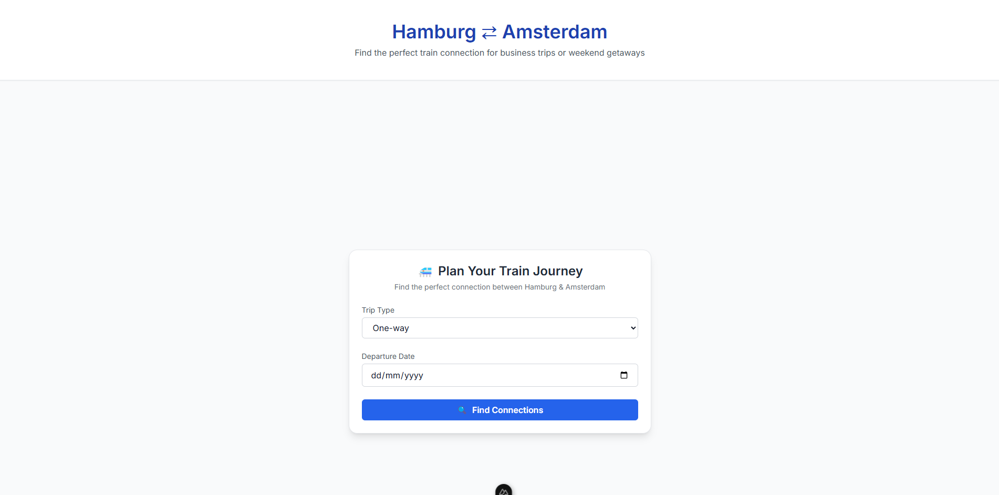
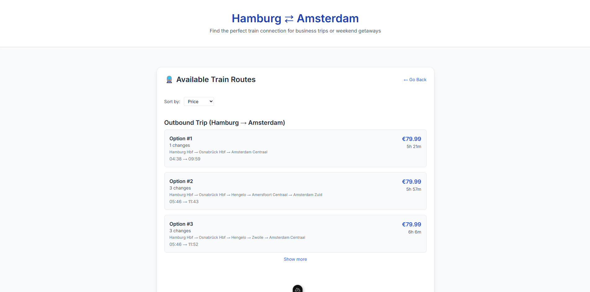
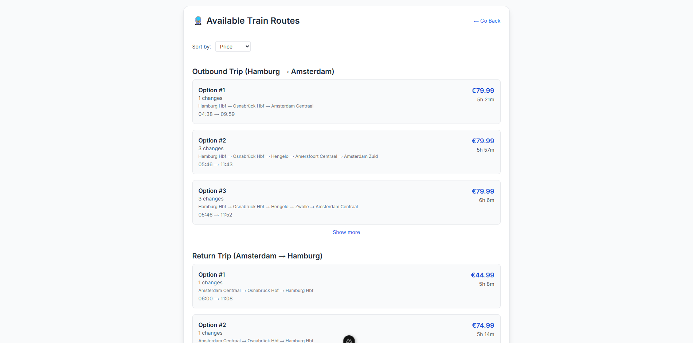

# 🚄 Hamburg ⇄ Amsterdam: Smart Train Finder

## 🎥 Demo Walkhthrough

[Click here to watch the recorded meeting](https://khiibaedu-my.sharepoint.com/personal/u_ahmed_17857_khi_iba_edu_pk/_layouts/15/stream.aspx?id=%2Fpersonal%2Fu%5Fahmed%5F17857%5Fkhi%5Fiba%5Fedu%5Fpk%2FDocuments%2FRecordings%2FMeeting%20with%20USMAN%20AHMED%20SAEED%2D17857%2D20250425%5F223439%2DMeeting%20Recording%2Emp4&ga=1&referrer=StreamWebApp%2EWeb&referrerScenario=AddressBarCopied%2Eview%2E2bd77c94%2D6f7e%2D471f%2D8513%2D96d7db6662b1)

[](https://your-deployment-link.vercel.app)
[](https://opensource.org/licenses/MIT)

Solution to use the internal DB Api to get the connection between Hamburg and Amsterdam

## How the Project Looks




## One-way Trip with an option to Show More



## Round-Trip with an option to Show More


## 🌟 Features

- Compare **cheapest** vs **fastest** routes
- Roundtrip planning with customizable overnight stays
- Clean UI with tabular results display
- Filters for duration, price, and number of changes

## 🛠 Tech Stack

- **Frontend**: Vue js
- **Backend**: Nuxt
- **Deployment**: Vercel

## 🚀 Quick Start

1. Clone repo:
   ```bash
   git clone https://github.com/umaan1982/route-finder.git

2. Install packages
   ```bash
   npm i

3. Run the server
   ```bash
   npm run dev

## ❌ My failed attempts to get data

 - Use Amadeus without researching properly that their rail API is enterprise level.
 - Use puppeteer to get data from bahn.expert/routing
 - User bahn.expert/routing internal api to get data
 - Use trainline API by reverse-engineering which does not work as it shows 401
 - Using puppeteer on trainline to get data which did not.

## ✅ My successful attempt.

 - Used DB Internal api to get the result and show it.
 - Parse the results into objects and extract relevant information relating to the project.
 - Reverse-engineered to get the internal API and make it work with Nuxt.

## File Comments

 - Index.vue is the main display page of the app that displays the form and calls the API to get search result from Hamburg To Amsterdam (one-way), and Amsterdam to Hamburg (roundtrip).
 - Then redirects the user to another page that is results.vue
 - Results.vue displays the trips, offer client-side rendering, and also offers sort by Price, Duration, Least Transfer Changes.
 - Has a GoBack to redirect back to Index.vue.
 - /server/api contains two api files that are being used.
 - /server/api/trainline contains three files which were being tested to get data (Puppeteer & API calls)
 - /layouts/default.vue contains the Header of the Project.
 - /composables contains another api call that was being tested for Location search.
 - /assets/css/tailwind.css contains the configuration for tailwind in the project.
